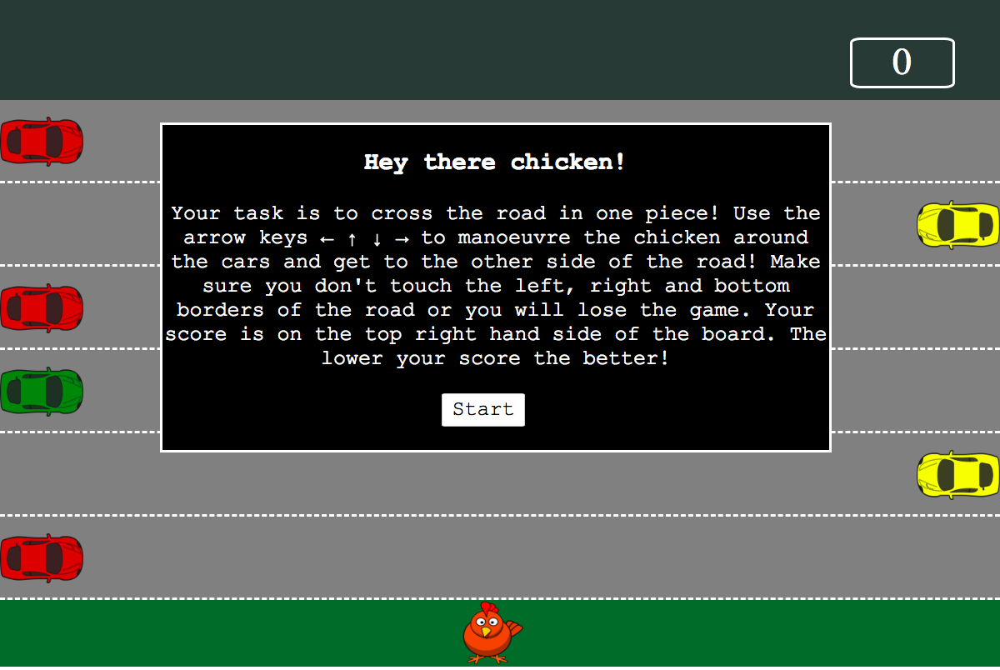
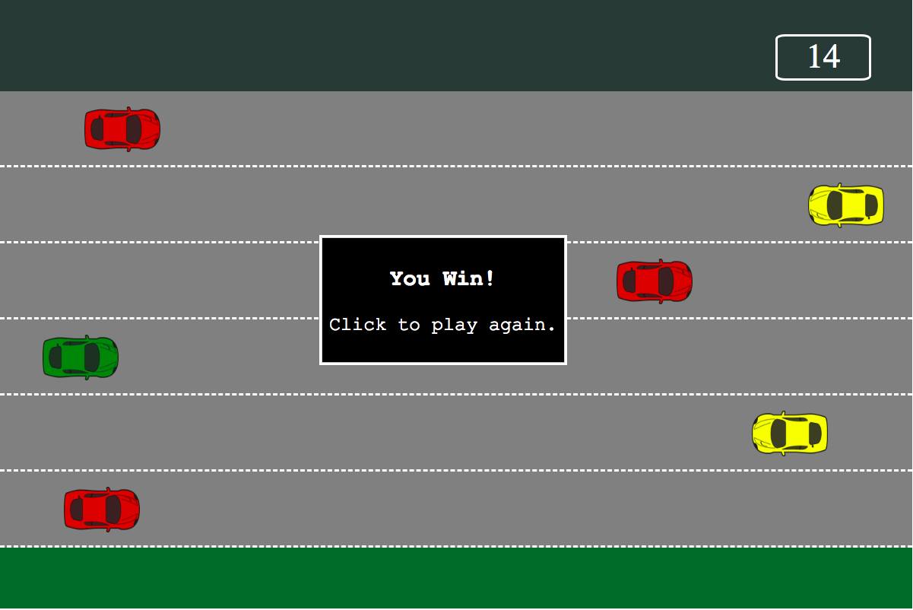
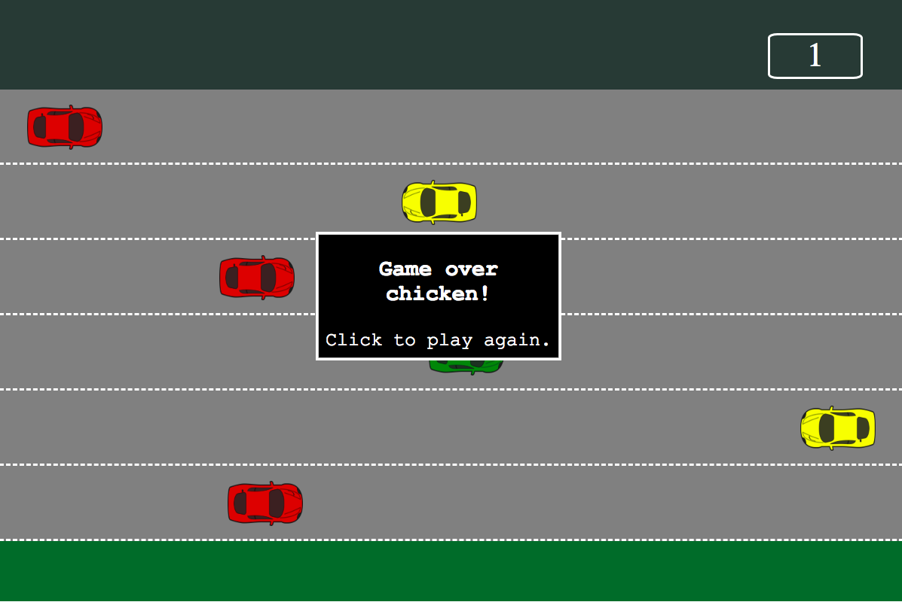

# Sparta-Core-Project-One


## Purpose
This is an HTML browser game built using HMTL, CSS and Javascript.
<br>
It was a short one week project to showcase recently acquired coding competencies in HTML, CSS and Javascript. <br>
Requirements: <br>

* Must have scoreboard
* Must have instructions
* Must have no alerts or prompts
* Canvas must not be used to build the game
* Game must look visually appealing

## Functionality
This is an HTML browser game. The aim is to use the arros keys to manipulate the player (a chicken) to cross a road (the game board) with six lanes of cars moving at different speeds. To win the game the player must move the chicken to the other side of the road without touching any of the moving cars. If any car hits the player, the game is over. If the player tries to move outside the board boundaries, the game is over. The score increases at a rate of one point per second. The quicker the player can get across the road the better, so the lower the score, the better.

## Implementation
The funcitonality has been implemented using the following features:

* HTML5
* CSS3
* JQuery
* Javascript

## Usage
#### Download
To download code visit the github repo name Sparta-Core-Project-One and click the clone or download button to download as zip.
Alternatively the following command can be copied into the terminal:

```
git clone hub.com/isabelvalente/Sparta-JQuery-TicTacToe.git
```

#### Customising
To customise the game modify the contents of the following files:

* JS/app.js
* index.html
* CSS/style.css

#### Running the game

To run the game open index.html on any browser. Or visit github pages [here](www.github.com).

## Challenges
There were two main challenges pertaining to this project. Firstly moving the cars and triggering when they disappear off the screen and reappear was a challenge because initially I was appending each car to the start of each lane and removing them at the end of the lane using JQuery `.append()` and  then `.remove()` however this caused problems because the cars were being removed before the animation started. After immense research I found that I needed to add `.queue` between `.animation()` and `.remove()` because the latter is not a queued function by default. This solved the problem and the cars were moving across the lanes and respawning as intended, but further down the line this caused the second major challenge. <br>
When I started to code the collisions between the chicken and the cars, I was able to pinpoint the chicken's position, but I could not access each car's position as they were constantly being appended and removed from the game board. Through trial and error I found that the chicken's position could be accessed because the chicken was not respawning and also because the chicken was not being appended using javascript but rather coded into the HTML. With this in mind I added a car to the HTML and was able to pinpoint it. Therefore I decided that the solution would be to add all cars to the HTML instead of appending them and removing them, this meant that my earlier challenge of making this function work was moot because I had to reconfigure my car movement animation and I could no longer use the `.append().animation().queue().remove()` code. However, I consider finding out about `.queue()` to have been a valuable learning experience which may be useful in the future.

## Code snippets
#### My original code for moving the cars across the board:


```javascript
function moveFastCar2(){
	$(fastCar2)
	.appendTo(".laneFive")
	.animate({left: "-=1500px"}, 5000)
	.delay(20)
	.queue(function(){
      $(this).remove();
    });
 }

```

In order to access the car I had to store it in a variable called 'fastCar2', but this made it difficult to pick up each car as it was respawned.

#### My current code for moving the cars:
```javascript
 function moveFastCar2(){
    $(".car4")
    .css("left", "1100px")
    .animate({left: "-=1100px"}, 5000, 'linear', function(){
      moveFastCar2();
    });
  }
```
Adding the car to the HTML meant I did not have to store it in a variable and could use JQuery to access it by its' class.

## Sprint Three
For the third sprint features that could be added include:

* Levels, where the speed and amount of cars could be altered as well as the lanes.
* Adding static objects to the gameboard so the player would have to avoid both the chicken and static objects.
* Adding an infitnity mode where the lanes moved down the page and the player plays for as long as they can.
* Adding a multiplayer game where two chickens try to race across the road.

## Screenshots
#### Instructions screen


#### Win screen


#### Lose Screen

